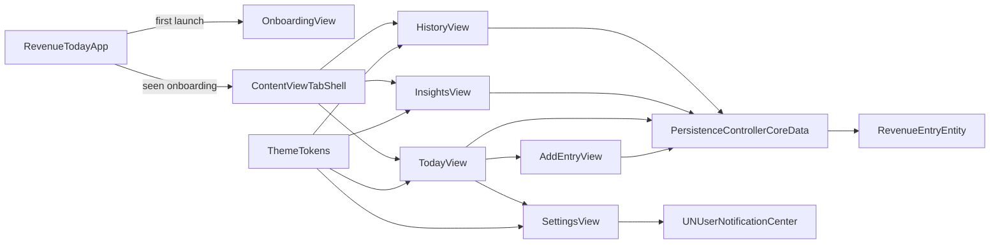

# Revenue Today

> Track cashflow with surgical clarity: income, expenses, P&L, pace, streaks, and client-level intelligence — all in a premium iOS experience.

[](#)
[](#)
[](#)
[](#)

Revenue Today is a focused financial operating system for freelancers, creators, consultants, and independent operators who need instant signal from daily money movement.

---

## Why This App Exists

- Most money trackers are bloated and generic.
- Revenue Today is optimized for speed: add an entry in seconds, then immediately understand today, this month, and long-term patterns.
- The app is fully local-first: your data stays on-device, works offline, and remains private.

---

## Core Experience

- `Today` — real-time dashboard for revenue, expenses, net profit, margin, pace, streaks, and best-day records.
- `History` — last-30-day visual P&L chart + monthly drill-down with expandable transaction lists.
- `Insights` — year heatmap (net-aware), client leaderboard with margin intelligence, and contribution share.
- `Settings` — notifications, dry-spell reminders, and effective hourly rate based on income-only math.
- `Onboarding` — polished premium intro that explains value and gets users to first action fast.

---

## Architecture at a Glance



---

## Data Model Depth

`RevenueEntry` (Core Data) powers the entire system with a compact but expressive schema:

- `id: UUID`
- `amount: Double`
- `date: Date`
- `createdAt: Date`
- `label: String?` (client/project context)
- `entryType: String?` (`"income"`, `"expense"`; `nil` treated as income for backwards compatibility)

### Migration strategy (safe + lightweight)

- Automatic migration enabled via persistent store description flags.
- `entryType` is optional with default `"income"`.
- Existing records with `nil` are interpreted as income through model helpers.

Domain helpers in `Persistence.swift`:

- `isExpense`
- `isIncome`
- `incomeOnlyPredicate` for fetch-level semantic consistency (especially pace and KPI calculations).

---

## System Design Decisions

### 1) Local-first architecture

- No account required.
- No remote datastore dependency for core workflows.
- Fast reads/writes with Core Data + derived in-memory computations in views.

### 2) Revenue semantics are explicit

- Anywhere the UI says "revenue", calculations are income-only.
- P&L surfaces both sides: income and expenses, then computes net + margin.

### 3) Temporal intelligence

- `TodayView` focuses on execution speed and immediate feedback loops.
- `HistoryView` models rolling behavior (30-day chart + month expansion).
- `InsightsView` transforms entries into pattern-level signal (calendar intensity + client quality).

### 4) Visual tokenization

- `Theme.swift` centralizes color tokens, spacing, and reusable UI affordances.
- Unified dark aesthetic with purpose-driven contrast for money states:
- Income: teal (`#00C896`)
- Expense: red (`#FF6B6B`)
- Net/primary text: white

---

## Feature Engineering Highlights

### Today Engine (`TodayView.swift`)

- Income/expense filter pills with grouped rows and day separators.
- Goal ring + goal achievement signaling.
- Pace indicator compares equivalent windows (this month vs last month) using income-only predicates.
- Swipe actions + context menus on rows for fast edit/delete/repeat workflows.
- Guardrails: daily entry warning/limit, validation states, subtle in-context hints.

### Entry Capture (`AddEntryView.swift`)

- Numeric keypad-first UX (no heavy form friction).
- Entry type toggle (Income vs Expense) with immediate visual feedback.
- Dynamic titles/labels and color system tied to semantic entry type.
- Edit mode preloads existing record state, including type.

### Historical P&L (`HistoryView.swift`)

- Grouped income/expense bars + dashed net line for immediate profitability read.
- Expandable monthly cards with revenue, expenses, net, and margin breakdown.
- Per-entry semantic rendering to preserve money meaning at every level.

### Strategic Insights (`InsightsView.swift`)

- Net-aware year grid: positive days trend green; negative days trend red.
- Client leaderboard computes revenue, expenses, net, and margin by client key.
- Mix visualization keeps percentage context grounded in revenue contribution.

### Ops & Retention (`SettingsView.swift`)

- Weekly summary notification pipeline.
- Dry-spell proactive alerts.
- Effective hourly rate derived from current month income and configured working hours.

---

## Tech Stack

- Swift 5 + SwiftUI
- Core Data
- Swift Charts
- UserNotifications
- AppStorage for lightweight preferences/state flags

---

## Project Structure

```text
RevenueToday/
  RevenueTodayApp.swift       # App entry + onboarding gate
  ContentView.swift           # Tab shell
  TodayView.swift             # Daily operating dashboard
  AddEntryView.swift          # Entry capture/edit flow
  HistoryView.swift           # P&L chart + month drilldowns
  InsightsView.swift          # Heatmap + client analytics
  SettingsView.swift          # Notifications + hourly rate
  Persistence.swift           # Core Data stack + model helpers
  Theme.swift                 # Design tokens + utilities
  RevenueToday.xcdatamodeld/  # Core Data model
```

---

## Build & Run

1. Open `RevenueToday.xcodeproj` in Xcode.
2. Select the `RevenueToday` scheme.
3. Run on iOS 16.6+ simulator or device.

---

## Privacy Model

- Data is stored locally on-device.
- No mandatory cloud account.
- Privacy/support pages are published under `docs/` and linked in-app.

---

## Product Philosophy

> Log fast. Read truth. Decide with confidence.

Revenue Today is intentionally opinionated: fewer taps, clearer signals, better decisions.
